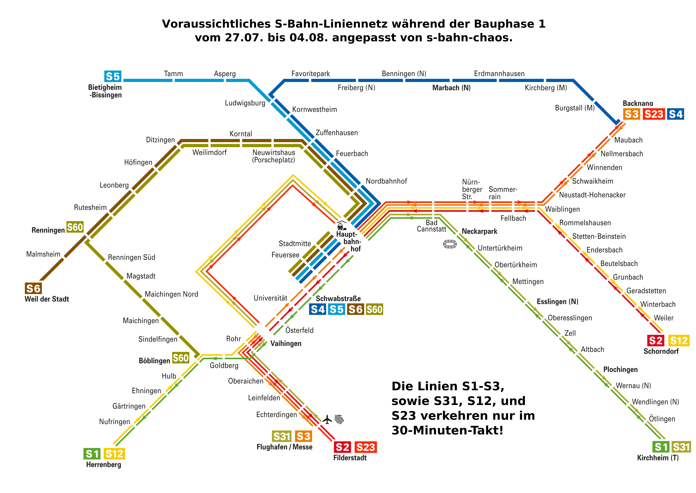
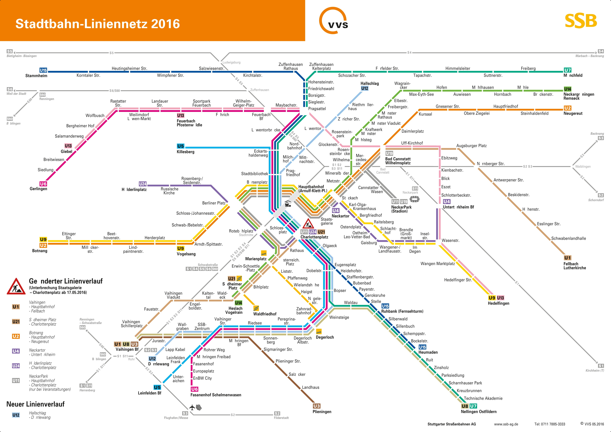
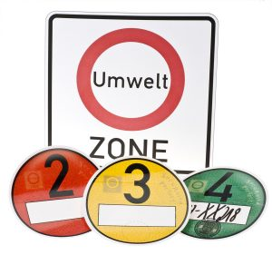

<!-- toc -->
# A SMALL GUIDE TO SETTLE DOWN IN STUTTGART AS UBC STUDENT

Hello! Welcome to this .git page. In this repository, UBC students will explain everything needed 
to peacefully come to Stuttgart! 

Add a note here about how to edit this page if you're currently in Germany

## Table of Contents  
<ul>
<li> <a href="#leaving_ubc">1. Leaving UBC</a>
 <ul>
  <li> <a href="#insurance">1.1 Insurance </a>
  <ul>
   <li> <a href="#ams"> 1.1.1 Qualifying for AMS Student Care </a> </li>
   <li> <a href="#leaving_ubc_else"> 1.1.2 Other Options </a> </li>
   </ul>
  <li> <a href="#visa">1.2  Visa </a>
  <ul>
   <li> <a href="#international_visa"> 1.2.1 International students</a> </li>
   <li> <a href="#us_citizens"> 1.2.2 US Citizens </a></li>
  </ul>
  <li> <a href="#looking_for_house"> 1.3 Looking for housing before arriving </a> </li>
  <li> <a href="#plane_tickets"> 1.4 Plane Tickets/Preparing for departure </a></li>
 </ul>
 <li> <a href="#settling_stuttgart"> 2. Settling Down in Stuttgart </a> 
  <ul>
   <li> <a href="#find_place"> 2.1 Find a place</a>
    <ul>
     <li> <a href="#air_bnb"> 2.1.1 Air Bnb </a> </li>
     <li> <a href = "#stuttgart_lonberg"> 2.1.2 Stuttgart and other areas </a> </li>
     <li> <a href = "#renting"> 2.1.3 Renting </a> 
     <ul>
      <li> <a href = "#house_registration"> Housing registration </a> </li>
     </ul>
     </li>
     </ul>
   </li>
   <li> <a href = "#commuting"> 2.2 Commuting </a>
    <ul>
     <li> <a href = "#city_link"> 2.2.1 City-Link </a></li>
     <li> <a href = "#spltr"> 2.2.2 SPLTr </a></li>
     <li> <a href = "#s_bahn"> 2.2.3 S-Bahn/U-Bahn</a></li>
     <li> <a href = "#driving"> 2.2.4 Driving (Diesel)</a></li>
    </ul>
   </li>
   <li> <a href = "#bank"> 2.3 Bank </a>
    <ul>
     <li> <a href = "#bank_2"> 2.3.1 Go to Deutsche Bank </a></li>
     <li> <a href = "#other_banks"> 2.3.2 Other Banks</a></li>
    </ul>
   </li>
   <li><a href = "#phoneplan"> 2.4 Phone Plan</a>
    <ul>
     <li><a href = "#pre_paid"> 2.4.1 Pre-paid </a> </li>
     <li><a href = "#best_companies"> 2.4.2 Best companies</a></li>
    </ul>
   </li>
  </ul>
 </li>
 <li><a href = "#work_environment"> 3. Bosch Work Environment</a>
  <ul>
   <li><a href = "#getting_paid"> 3.1 Getting paid at Bosch </a></li>
   <li><a href = "#food"> 3.2 Food - Intern Discount</a></li>
   <li><a href = "#flex_time"> 3.3 Flex time/Vacation</a></li>
  </ul>
  </li>
 <li> <a href = "#learning_german"> 4. Learning German</a>
  <ul>
   <li><a href = "#learning_german_why"> 4.1 Why?</a></li>
   <li><a href = "#tools_and_resources"> 4.2 Helpful tools and resources</a></li>
  </ul>
 </li>
 <li><a href = "#life_in_stuttgart"> 5. Life in Stuttgart</a>
  <ul>
   <li><a href = "#parties"> 5.1 Parties</a></li>
   <li><a href = "#hikes"> 5.2 Hikes</a></li>
   <li><a href = "#travels"> 5.3 Travel, etc…</a></li>
   <li><a href = "#expats_stuttgart"> 5.4 Expats in Stuttgart FB group</a></li>
  </ul>
 </li>
 <li><a href = "#bonus"> 6. Bonus: Like a bOsCh</a></li>
 </ul>
 </li>
 </ul>
 
<h2 id="leaving_ubc"> 1. Leaving UBC</h2>

some filler text, but wow you should apply to BOSCH 'cause they absolutely DO NOT FORCE ME to write that down
 I WILL PUT A LOT OF TEXT HERE!
 
<h3 id="insurance"> 1.1 Insurance </h3>
  
You need health insurance to live and work in Germany. If you're a non-EU citizen, this is a crucial component of applying for your residence permit.

<h4 id="ams"> 1.1.1 Qualifying for AMS Student Care </h4>

AMS Student Care health insurance coverage is part of your student fees at UBC. Part of this coverage includes travel health insurance. However, this health insurance is only active (regardless of if you paid for it with your co-op tuition) if you are paying for MSP (provided by the providence of British Columbia) or a similar basic private health insurance for BC.

You only qualify for MSP if you are living as a residence in BC. If you leave BC for up to 6 months, this is ok. You can continue to pay for MSP online and you will still qualify for the travel health insurance with AMS Student Care. If you are away from BC for longer than 6 months, you will need to purchase basic private health insurance for BC in order to qualify for the travel health insurance with AMS Student Care once you are gone for longer than 6 months. 

<h4 id="leaving_ubc_else"> 1.1.2 Other Options </h4>

If you recieve health insurance through a parent or family member, this is usually a good alternative to AMS Student Care travel health insurance. 

<h3 id="visa"> 1.2 Visa </h3>

<h4 id="international_visa"> 1.2.1 International students </h4> 

<h4 id="us_citizens"> 1.2.1 US citizens </h4> 

As a US citizen, you have two options to apply for your visa: 

1. Before moving to Germany, schedule an appointment with the Toronto German Consulate, and fly to Toronto with all the required documentation for your visa application. You will need x,x,x,x,x, and x. The German Consulate will process your information and hold onto your passport until you are issued your visa. This typically takes a few days, unless there are issues with your application. This option is the best for ensuring you can begin your work term at Bosch on time.  

NOTE: Scheduling an appointment early with the Toronto German Consulate is key. Appointments book quickly and you may end up having to leave UBC during exams and end of term to take care of your visa. This can be extra stressful and not fun. So save yourself the stress and book it early. 

NOTE: Ok. I'm a US citizen though. Why do I need to go all the way to Toronto to apply for a visa? The simiplest answer is this is the way the German government decided to set up their consulates. You must apply for visas and permits in your country of residence (most likely Canada) and not your country of citizenship. Not all consulates process visa and permit applications (Vancouver's consulate does not), so Toronto is where you gotta go. This is your first taste of German bureaucracy - hold on tight, it's gonna be a wild ride.  

2. Arrive in Germany at least a month before you are scheduled to begin your work term at Bosch. As a US citizen, you can reside in Germany for up to 90 days without a visa. Upon arriving, immediately contact the Ausländerbehörde (aka the Foreigners Authority) to set up an appointment for your residence application. There is a specific phone number you can call based on your last name or you can submit an email requesting an appointment. To find this number and more information about setting up an appointment, visit this website https://www.stuttgart.de/item/show/318412. It is incredibly important when you request an appointment that you stress the time sensitivity of your situation. Include that you are a US citizen, a student trying to start an internship, and when you are scheduled to start employment. Typically, appointments can take months to schedule. But by pleading your case in your first communications, they will usually work to schedule your appointment within a month.  

Once you have an appointment scheduled, you will recieve a list of documents to submit. These may include: Antragsformular (application form), Praktikumsvertrag (employment contract), Zustimmung der Agentur für Arbeit (ZAV) (approval from the employment agency), (aktueller Wohnraumnachweis vom Eigentümer unterzeichnet und Kopie Mietvertrag) your housing certificate signed by the person owning the property and your rental contract, and aktueller Krankenversicherungsnachweis (proof of health insurance coverage in Germany). Typically, you will be asked to submit these documents via email prior to your appointment date.  

NOTE: Make sure your employment contract lists the correct start and end dates of your work term. Bosch is responsible for obtaining approval from the employment agency. This approval is only granted for the dates within your work contract and therefore your residence permit is only granted for the dates within your work contract. 

NOTE: The proof of health insurance coverage in Germany can be difficult to obtain. In some cases, they may ask you to have your insurance company sign a form. Once you recieve the form from the German authorities, immediately begin the process of contacting your insurance to sign the form. Without the signed form, they will not grant you a residence permit regardless of the other documentation you provide to prove your health insurance. 

To the appointment, make sure to bring with you
-a printed version of the documents you were asked to submit if possible,
-your passport, 
-two biometric photos (the restrictions for these photos can be found here - https://www.schengenvisainfo.com/photo-requirements/), 
-and the fee for the permit. 

<h3 id="looking_for_house"> 1.3 Looking for housing before arriving </h3>

<h3 id="plane_tickets"> 1.4 Plane Tickets/Preparing for departure </h3>

<h2 id="settling_stuttgart"> 2. Settling Down in Stuttgart </h2>

Arriving in Stuttgart can be stressful since most of us are not europeans nor speak German. This section contains tips and ressources that you could use to "easy" your settling and start enjoying a life without problems... and administration. For records, it took Sophia and I about a months to fully settle down here. A... Stressful month. I would recommand to arrive in Stuttgart one or two week before your internship starts so you can deal with the housing/phone/bank. 

<h3 id="find_place"> 2.1 Find a place </h3>

The most important thing to know before you start looking for a place to stay at is commute and the transport system (Refer to section <a href="#commuting"> 2.2</a>).
It is encouraged to house hunt in person instead of doing it from the Canada. There sometimes is scams happening and being present to visit the place is preferable (even if you don't speak German). 

For example, Sophia and I visited an attractive place in Renningen mid-May, just to learn afterward that the renting started early August. 

<h4 id="air_bnb"> 2.1.1 Air Bnb </h4>

Air bnb is always a great ressource to quickly find a transition place until you get your appartment/room. People hosting you are usually really kind and are willing to help you out with your translations/house registration/etc. You can get familiar with the city without stressing over a logement. 

<h4 id="stuttgart_lonberg"> 2.1.2 Stuttgart and other areas </h4>

Stuttgart might sound attractive but it is EXTREMELY expensive. More than half our poor salary can go for rent if we're not careful. Chosing a place closer to Renningen might be a good choice. We would recommand Leonberg and it's environt. Wie-der-Stadt could also be a good choice (only two S-bahn station away). 

Finding a place in Renningen would be best but also expensive. This is due that the two main economic actors in Renningen are Bosch (1200 employees) and the American military base. As a result people move a lot in and out of Renningen so the prices goes up.
  
<h4 id="renting"> 2.1.3 Renting </h4>

Finding a place to live in Stuttgart when we live 5000km away can be… quite challenging. Where do we start? Who are we contacting? How? We’ll try to answer these questions in this section. 

<h5> Student Housing </h5>
<Mahdin/Anand>
<h5> Bosch Housing </h5>

<Anyone who can help>
 Bosch sent you a list of <i> available accomodations </i> in your contract... in german. But hey... it still helps.

<h5> Own Appartment </h5>

Renting your own studio is awesome. You don’t have to share any kitchen/shower with roommates. You don’t have quiet hours… YOU CAN BE FREEEEEEEEE. However, it can quickly become expensive and… our poor salary won’t make it to the end of the month. 
There are two options when you look for your own studio/room. Look yourself on sites such as the german craiglist. The other option is to pass through an agency that will do the scooting for you.

In any case, I highly encourage everyone to visit the appartments/houses IN PERSON before paying deposit... for many reasons we’ll explain in a section below [link to section].

<h6> “Agencies” </h6>

One might think that contacting an agency would be a good move… and is right. Agencies are a good resource to help you think a reliable place. Agencies have good quality standards and are only renting places they have a contract with the owner. 

<b> Pros: </b>
<li> <b> Speaks English </b> - the communication can be easily done in english. The person will ask you what you are looking for, what are your price ranges, and expectation then will send you offers from time to time that fits your needs. </li>
<li> <b> Quality Assurance </b>- the apartment rented through an agency will be clean and good. They cannot do false advertising so you’ll pay for what you see online. </li>
<li> <b> Reliable </b> - The dates of moving in, the rent price, etc… all you will see in the online ad will be “true”. Therefore, you have barely any chances of visiting an apartment that will only be available two months after your visit. </li>
<li> <b> Paying </b> - You will pay directly to the agency so you have little chances of being scammed (I’ll explain more in the “Do it yourself” section [link to paragraph]). </li>
 
<b> Cons: </b> 
  
<li> <b> Expensive </b> - the general rule to go by is that you’ll lose 2-3 months of rent a year. In other words, if you decide to rent an apartment with an agency, they’ll increase the prices so they can profit of 2-3 extra months worth of rent. </li>
<li> <b> Deposit </b> - they will have you pay the first month of rent plus the deposit before you move in. In other words, make sure you have enough money to pay the deposit + first month before you get your first Bosch paycheck. </li>
<li> <b> Paperwork </b> - They want proof that you will be able to pay for the full extent of your internship (+proof of visa/identity). Why is that? Because in Europe, we cannot kick people living in your place easily, even if they stop paying rent (the process of kicking a tenant out takes 1-2 months). So the agency will be afraid that you will stop paying rent halfway through then cannot kick you out. So it might become a hassle to deal with paperwork but it is to protect both the tenant and the landlord!</li>
<li> <b> Online </b> - Most of the agencies operates online and through emails. They do not encourage meeting in person to discuss your needs and expectations.</li>
 
Link to some agencies: 
<li> <a href="https://www.hc24.de/en/furnished-living-space-in-stuttgart.htm">[HC24] </a></li>
<li> <a href="https://www.homecompany.de/de/index"> [Home Company - Online only] </a></li>
 
BONUS: <a href="https://www.toytowngermany.com/forum/topic/372037-tenant-refuses-to-pay-rentquick-resolution/"> Europe is crazy </a>

<h6> "Do it Yourself" </h6>

Link to websites: 
<a href="https://www.wg-gesucht.de/">[WG-GESUCHT] </a>
<a href="https://www.immobilienscout24.de/"> [Immobilienscout24 - closest equivalent to craiglist] </a>

<h5 id="house_registration"> Housing registration </h5>

<h3 id="commuting"> 2.2 Commuting </h3>

Commuting to work is maybe the parameter that will most impact your life in Germany. The choice between a 30min and a 1h30 long commute is easy to make (at least for me). The first option allows one to have more free-time. The condition in which you commute is also important. Would you rather have a 1h30 long bus ride with wifi or a 1h30 long train ride with 3 train changement and no wifi nor AC. This section is here to help you understand how stuttgart train system works and how you can easily travel to your work place without losing time/energy.

<h4 id = "city_link"> 2.2.1 City-Link </h4>

The City-Link will be your favourite ressource! City-Link is a commuting system by Bosch. 

City-link is two FREE buses for employees living in Stuttgart downtown. The Bus is direct to Renningen and can pick people up at two bus stops> Rotebühlplatz and Swartzstraße. The buses have wifi and AC. This is a free service provided by Bosch... and honestly it is a life saver. It allows people who does not want to spend 300€ for a student travel pass to still be able to live in Stuttgart Downtown. 

PROS: 
<li> Free </li>
<li> Fast (40 min from Downtown) </li>
<li> Wifi + AC </li>
<li> Several buses per the day </li> 
CONS:   
 <&#39none>   
 
NOTE: You will not be able ot find any information about the city link online. This is a service we usually learn about when we arrive. However we belive it should be known beforehand as it would have changed our house hunting plans. 
<a href="https://www.instagram.com/klingelreisen/p/BpFZSM1nGyR/"> City-Link-beautiful-picture-found-online </a>

NOTE 2: I only know about Bosch Renningen but I bet other location will have something similar. Feel free to (try to) contact other interns at other location to ask for it. If it exist, please contact me so I can edit the document. 

<h4 id="splr"> 2.2.2 SPLTr </h4>

SPTLr is another ressource from Bosch to help employees to commute to work. SPTLr is a car share app that allows anyone using it to either register as Driver or Guest. That allows employees living in remote areas to commute together in order to reduce the costs (and carbon footprint). The app is relatively new and still need improvement as not many people is using it. However that can still be a ressource worth looking into. 

PROS:
<li> Car share: you can register as driver to reduce your expenses or guest to join a driver </li>
<li> Locations: buses/train can be annoying from time to time and the car share system is allowing to bypass that </li>
<li> Social: it can be good to force you to practice German, every day for your commute </li>
<li> Money: pay directly from the app so you don't have to do anything in this regard </li> 

CONS: 
<li> Users: not many  </li>
<li> App: app design isn't the most intuitive and it is also relatively new </li>
<li> Registration: you need a Bosch email address, you can register to it only after starting work </li> 

SPLTr will probably become onof the best commuting car sharing apps for the Bosch community. However, I would not rely on it when house hunting

<h4 id="s_bahn"> 2.2.3 S-Bahn/U-Bahn </h4>

The S-Bahn transport map: 
 

The U-Bahn transport map: 
 

It is important to know that the cost to travel in zone 1 is 2.50€ (2.37€ if you pass by the official VVS app, internet required). The cost to travel to Renningen from Stadtmitte is ~5.50€ (~11.00€ for a two way traject). The cheapest option is to travel in zone one to take the city-link. 

There are student plans and other plans available but since I am not using them I cannot help. The handsome and extroardinary  Mahdin will fill this section.

<h4 id="driving"> 2.2.4 Driving </h4>

For thoses are tempted to use a car around Stuttgart there are few things you need to know. First of I would say it is worth for many reasons (cheaper than commuting, SPLTr,  travels to black forest/europe/etc., hollidays with other interns, live closer to work, etc.). However, Germany has some STRICT ecological restriction regarding diesel cars allowed in certain areas. 

There is an environment restriction for diesel cars. Some diesel cars are not allowed to drive in certain zones. The fine is 80€. This is rather serious as in some areas the air quality is extremely bad. The restriction is about the particle emissions (how the engine burns the fuel) so there is nothing we could do about it. 

<b> IMPORTANT NOTE: The restriction is ONLY about diesel cars. Gasole cars can drive freely no matter how fuel efficient they are.</b>

Currently the only diesel cars allowed to drive in Stuttgart/Leonberg are thoses with a EURO-class of 5 or more, however the change from "class 4" to "class 5" is relatively new so there is a transition period (I am currently driving an EURO-class 4 and do not have problems with it). For the sake of the environment we'll highly recommand anyone who plans on buying/renting/using a car in this area to follow the environmental norms. 

If you are driving a diesel car, you will need a Umwelt-Plakette. You can buy them at any car retail store (7€) or any civil office. You will only need to bring your car papers with your driving license, there isn no further document required. 

Info: 
 
[Umwelt Plakette Website](https://www.umwelt-plakette.de/en/information-about-german-environmental-badge/environmental-zones-in-germany/german-environmental-zones.html)
 
[Stuttart Info](https://www.umwelt-plakette.de/en/information-about-german-environmental-badge/environmental-zones-in-germany/german-environmental-zones/stuttgart.html)
 
[Green-Zone EU app](https://www.green-zones.eu/en/info-apps/information-offers/the-green-zones-app.html)
 

<b> IMPORTANT NOTE: The english website says that EURO-class 4 are allowed in Stuttgart, however, this was changed. From April 1st, 2019, only EURO-class 5 and higher are allowed. </b> 

<h3 id= "bank"> 2.3 Bank</h3>

You need to open a German bank account to get paid. No, you cannot use your Canadain/US/French account instead. Banking in German is a bit different than in Canada. There’s no Interac Transfer and the process is a bit more complicated (i.e. more paperwork). Below are some options with the pros and cons that we’ve learned along the way.

<h4 id="bank_2"> 2.3.1 Go to Deutsche Bank (need better title) </h4>

<h5> Opening an Account </h5>

While working at Bosch, you can open a Deutsche Bank account for free. Make an appointment online or via phone at a branch close to you. Make sure to bring along your passport, Bosch work contract, and residence registration to the appointment. In roughly 2 meetings with an advisor, you can have a fully working bank account with a debit card ordered.

<b>NOTE:</b> If you’re a US citizen, you’ll also need your SSN and will be asked to fill out a tax form for the US government. Ask to fill out this form during the appointment. You won’t need to go through the hassle of printing the form, mailing it in or stopping by the specific bank branch again.

<h5> Pros with Deutsche Bank</h5>
<li>Their customer service is top notch</li>
<li>You can withdraw cash from ATMs around Europe without fees at select banks. You can also withdraw cash from your ScotiaBank account without fees from Deutsche Bank ATMs (regardless of if you have an account with Deutsche Bank)</li>
<li>Online banking. Their phone app is efficient and they’ll help you set everything up in person if you request a meeting</li>
 
<h4 id="other_banks"> 2.3.2 Other Banks </h4> 
<h5> N26 </h5>

 Anand to fill this section. How to set up an account? Pros and cons of using this bank. 

<h5> Commerzbank </h5>

From our experiences, Commerzbank is very frustrating to open an account with. While you can try and open an account online without an appointment, you will end up having to prove your identity (bring your passport) at a PostBank or in-person unless you’re a German citizen. If they need to send you your ATM card more than once, they will charge you 5€ each time they send it. They will also charge you when they send you correspondence through the mail. 

If you feel the need to open an account with Commerzbank here are some tips so hopefully you don’t get ripped off:
<li> Be prepared to provide an address where you can receive mail at and you are registered with the German authorities. This is how you receive your ATM card. In Germany, mail is delivered based on the name on the postbox. If you’re name is not on the postbox, provide a care-of (CO) name that is on the postbox along with the address </li>
<li> As soon as you have access to your online banking, opt out of receiving mail through the post. This means they will send you correspondence online and won’t charge you for it </li>

<h3 id="phoneplan"> 2.4 Phone Plan </h3>

<h4 id="pre_paid"> 2.4.1 Pre-paid </h4>

<h4 id="best_companies"> 2.4.2 Best companies </h4>
  
<h2 id="work_environment"> 3. Bosch Work Environment </h2>

<h3 id="getting_paid"> 3.1 Getting Paid at Bosch </h3>

 The first day of work your supervisor will send you an “intern welcome” email. In this email, there will be a link to a form that you NEED to submit to HR as soon as possible in order to get paid (PLEASE FILL THE GERMAN FORM AS THE ENGLISH FORM DOESN’T COUNT FOR HR). This form will ask you for German SIN that you will get at the civil office after registering your housing. Why is this “SIN” important? Part of it refers to your tax class. In germany there are different tax classes, and without a tax number provided by the civil office you’ll be charged at the highest rate. And yeah… losing 120€ at the end of your first month isn’t the most pleasant experience. So please, make sure you request the “sin” right after registering your housing. 

<h3 id="food"> 3.2 Food - Intern Discount </h3>

Don’t worry about bringing lunch with you. At Renningen, there is a cafeteria where everyone eats. It’s open weekdays from 11:30-14:30. As an intern, you receive a discount of X.XX€ on every meal. Depending on what you choose to eat, you typically spend 1.30€ to 3€ per meal. You pay for food with your Bosch ID card. Your balance can be refilled with cash at the kiosk directly outside the cafeteria.  

<h4>Cafe</h4>

There’s also a cafe on campus where you can purchase breakfast, lunch and snacks. Sadly, no discounts are available for interns here but you can use cash and your Bosch card for purchases. 

<h4>Coffee and Snacks</h4>

There’s free coffee, milk and sugar in your office! You can make yourself espresso or coffee crema. Be prepared to have the machine notify you German to refill the water tank or dispose of the coffee grinds every once in a while. There’s also coffee machines where you can get fancy coffee by paying with your Bosch card. Vending machines around campus offer snacks for purchase with your Bosch card as well. These vending machines can also be used to check your balance on your Bosch card before heading to the caf for lunch. 

<h4> Fun fact </h4>

On the building 131 floor 2, if ever you forget to lock your computer and someone sees it. He'll send an email to the whole floor saying you will bring cake. Yeah... don't forget to lock your computer or you'll have to bring cake for everyone!

<h3 id="flex_time"> 3.3 Flex time/Vacation </h3>

Each day, you are expected to work 7 hours and take 45 minutes for lunch and breaks. Due to German law, you may not work longer than 10 hours. Your working time is tracked when you tap your card upon arrival to Bosch and when you tap out at the end of the day. You can find all of this documented in the your Time Management page within Bosch’s internal HR pages. You can also adjust your break time to up to an hour. 

Flex time is the time management schedule the interns are working with. In order to avoid paying interns for overtime, Bosch will instead “store” the hours you have to be redeemed. An example would be: if one day you work 10h, the other day you can leave work early after 5h30 in. As long as the combined time for two days is 15h30, you will be fine. That also means that if you work 10h per day (monday, tuesday, wednesday and thursday), you can have a 3-day weekend by using your flex time instead of your vacation time! In the Time Management page, when you take a day off of work, you create an entry and specify if the time off is vacation or flex-time. 

Depending on the length of your internship, you’ll receive some vacation days which can be found in your contract. 

<h2 id="learning_german"> 4. Learning German </h2>

<h3 id="learning_german_why"> 4.1 Why? </h3>

You don’t need to learn German to perform well at Bosch. But boy, oh boy, it will enrich your experience and time in Germany immensely. It will take time, energy, and extra effort. However, you will learn to think differently and connect with others in ways you may not be able to in English. (e.g. A classical reading of Rammstein by Tom Walther)

<h3 id="tools_and_resources"> 4.2 Helpful tools and resources </h3>

There are many resources out there to aid you in learning German if you’re interested. Find stuff that works for your brain and you enjoy doing on a daily basis. Below are a few resources we’ve found to be helpful.

<ul>
 <li> <b> Duolingo </b>
  <ul>
   <li> Great for getting started and building a foundation of the language. Best if used daily. At first, it can seem silly and childish. But as you advance, you can start to recognize patterns in the language and it can become a powerful tool.
   </li>
  </ul>
 </li>
 <li> <b> Google Translate </b>
  <ul>
   <li>Great when you really need a quick translation. You can download languages to your phone, translate text directly from photos and more. 
   </li>
  </ul>
 </li>
 <li> <b> Podcasts </b>
  <ul>
   <li>There are a lot of podcasts out there trying to teach you German. Below are a few that have been worth a listen that can be found through Apple Podcasts and other platforms.
   </li>
  <li> Slow German mit Annik Ruben: <a href= "https://slowgerman.com/"> link here </a>
   <ul>
    <li> This one is exactly what the title sounds like. Episodes are usually 10-15 minutes long. Annik talks 100% in German, slowly. A complete transcript can be found in the episode description, making it easy to follow along and pick out words you want to review later. Episodes are typically about German culture, history or geography. When first starting out, don’t worry about understanding every word. Listen and read for words you recognize. Try and learn new words from the context of the episode. 
    </li>
  </ul>
 </li>
 <li> Coffee Break German: <a href= "https://radiolingua.com/category/coffee-break-german/"> link here </a>
  <ul>
   <li>Mostly in English, this podcast will explain grammar rules and teach you new German vocabulary. It also invites you to practice speaking aloud and recall phrases from previous episodes.</li></ul></li>
   </li>
  </ul>
 <li> <b> TV shows </b>
  <ul>
   <li>Great for immersing yourself into the German language and culture. You can play most shows with English or German subtitles while listening in German. The shows below can be found on Netflix.
    <ul>
     <li> Dark </li>
     <li> How to Sell Drugs Online (Fast) </li>
     <li> Babylon Berlin </li>
    </ul>
   </li>
  </ul>
 </li>
 <li> <b> Native German speakers </b>
  <ul>
   <li>Most Germans appreciate others who are working to learn German. Reach out to your new colleagues and friends for help with pronunciations and translations. Practice speaking with them and ask for feedback. 
   </li>
  </ul>
 </li>
</ul>

<h2 id="life_in_stuttgart"> 5. Life in Stuttgart </h2>

<h3 id="parties"> 5.1 Parties </h3>

<h3 id="hikes"> 5.2 Hikes </h3>

<h3 id="travels"> 5.3 Travel, etc... </h3>

Wanna explore Milan? Head to Paris? Go for it! Here’s a few of our tips that we’ve learned through our experiences. 

<ul>
 <li>If traveling on a budget, look for hostels. Usually reasonably priced, you can get a bed and a place to shower, sometimes breakfast too. If you’re lucky, you may meet some fellow travelers and make some friends. Pro tip: most hostels have lockers to secure your stuff while you’re out exploring. Bring a lock with you to take advantage of this.</li>
 <li> Pack light. Most transportation options limit the number of bags you can take and their size and weight. Be aware of this or you may have to pay extra. </li>
 <li>Schedule your transportation and accommodations early. This may seem like a no-brainer, but you can save quite a bit moola with a little advanced planning. </li>
 <li> Planes, trains, and automobiles, oh my! There’s quite a few options to get around.
  <ul>
   <li>Planes - best for quick long distance travel throughout Europe. Schedule early if you can for the best deals</li>
   <li>Trains - good if you wanna see the land you’re passing through. Usually pretty comfty with plenty of leg room and space to sleep (and often wifi onboard).</li>
   <li>Buses - FlixBus is cheap. Can usually take about the same time as trains, but less comfy and sometimes cheaper. Be prepared for stops along the way, some delays, and random customs searches.</li>
   <li>Car-share services like BlaBlaCar </li>
  </ul>
 </li>
</ul>

<h3 id="expats_stuttgart"> 5.4 Expats in Stuttgart FB group </h3>

This group is a helpful resource and community. Comprised of mostly english speakers, you can pose questions to the group, join events, and meet other expats living in Stuttgart. Have a question about living in Germany? Ask it here. Often, there are events every weekend around town.

<h2 id="bonus"> 6. Bonus: Like a bOsCh </h2>

The BEST video you will ever see... and need. 

 <iframe 
         width="1352" height="595" 
         src="https://www.youtube.com/embed/v2kV6pgJxuo" 
         frameborder="0" 
         allow="accelerometer; autoplay; encrypted-media; gyroscope; picture-in-picture" 
         allowfullscreen
 ></iframe>
   
  
 Collaboration: Sophia Gut, Alexandre Guichet

 
